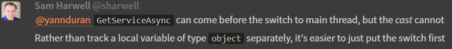
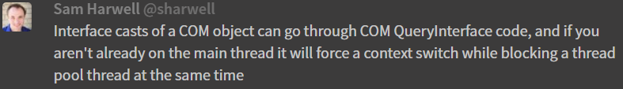

!!! note "Work In Progress"

    This documentation is still a work-in-progress.

*Luminous Code* currently consists of two Nuget packages:

- Luminous.Code.Core
- Luminous.Code.VisualStudio

## Luminous.Code.Core

`Luminous.Code.Core` is a plain C# class library project that contains the lower level classes, methods and extension methods that get used by more
specialised projects such as `Luminous.Code.VisualStudio`.

!!! note "Lack of 'Core' in the Namespace Names"

    I decided that there was no benefit to including `Core` in the namespaces because it sometimes made the namespaces sound a bit odd.

### Extensions Namespace

#### ExceptionExtensions

The `Luminous.Code.Extensions.ExceptionExtensions` namespace is fairly self-explanatory.
It contains a set of extension methods that extend the `Exception` type.

- ExtendedMessage Method

    The `ExtendedMessage` method returns the message of the innermost exception,
    or the original exception message if no inner exceptions exist.

#### StringExtensions

The `Luminous.Code.Extensions.StringExtensions` namespace is fairly self-explanatory.
It contains a set of extension methods that extend the `string` type.

- JoinWith Method

- To<T\> Method

## Luminous.Code.VisualStudio

`Luminous.Code.VisualStudio` is a plain C# class library project that contains the lower level classes,
methods and extension methods that pertain to creating Visual Studio extensions.

It has a project reference to the `Luminous.Code.Core` project, as it relies on some of the code in it.

### Commands Namespace

The `Luminous.Code.VisualStudio.Commands` namespace contains all of the plumbing code that
a command needs to interact with the Visual Studio IDE (via the command's parent package).

#### AsyncCommandBase

The `Luminous.Code.VisualStudio.Commands.AsyncCommandBase` class is an abstract class, which acts as the
common base class for the `AsyncStaticCommand` class and the `AsyncDynamicCommand` class.

It contains all of the plumbing code that a command needs to interact easily with
its parent package. It also has the ability to communicate with the IDE.

#### AsyncDynamicCommand

The `Luminous.Code.VisualStudio.Commands.AsyncDynamicCommand` class can be used for commands whose *text* may need to change,
and/or which may need to dynamically determine if the command needs to be *visible* or *enabled*.
Three sensibly-named overridable properties are provided to make this easy and flexible.

Both the command's `Visible` property and `Enabled` property are automatically calculated based on the values of
`CanExecute` and `IsActive`.

- CanExecute Property

    If `CanExecute` returns `false`, the command cannot be executed at all.
    The command's `Visible` and `Enabled` properties will both automatically be set to `false`.

    For example, command classes that inherit from `AsyncDynamicCommand` can override this
    property to return, say, a package-wide value that can be set in *Tools* | *Options*,
    or use some other method of determining if the command's functionality should be turned
    off.

- IsActive Property

    If `IsActive` returns `false`, the command's `Enabled` property is automatically set to false.
    A common use for this property is to be able to check a *UI Context*.

- Text Property

    The `Text` property, as its name suggests, sets the command's display text. Its initial value is `null`,
    which instructs the famework to use the value set in the *VSCT* file.

#### AsyncStaticCommand

The `Luminous.Code.VisualStudio.Commands.AsyncStaticCommand` class is useful for commands whose text doesn't need to change,
and which are always visible and always enabled.

#### CommandBase (deprecated)

The `Luminous.Code.VisualStudio.Commands.CommandBase` class has been deprecated in favor of `AsyncCommandBase`.

#### Command Keys

#### CommandResult

- CancelledResult

- InformationResult

- ProblemResult

- SuccessResult

#### CommandStatuses

#### DynamicCommand (deprecated)

The `Luminous.Code.VisualStudio.Commands.DynamicCommand` class has been deprecated in favor of `AsyncDynamicCommand`.

#### StaticCommand (deprecated)

The `Luminous.Code.VisualStudio.Commands.DynamicCommand` class has been deprecated in favor of `AsyncDynamicCommand`.

### Constants Namespace

#### VsVersions

### Extensions Namespace

#### IntegerExtensions

#### IWpfTextViewHostExtensions

#### ProjectItemsExtensions

#### ServiceProviderExtensions

### Packages Namespace

The `Luminous.Code.VisualStudio.Packages` namespace contains all of the plumbing code that
a Visual Studio package needs to interact with the Visual Studio IDE.

#### AsyncPackageBase

The `Luminous.Code.VisualStudio.Packages.AsyncPackageBase` class is an abstract base class from which you inherit your own
packages.

- GetService<T\>

    The `GetService<T>` method is a small piece of syntactic sugar around `Package.GetService`,
    which avoids the need for`typeof` and takes care of the cast to `T` as well.

    I just find it nicer to be able to write `GetService<ISomeInterface>` than
    `GetService(typeof(T)) as T`.

- GetService<TSource, TTarget>()

    The `GetService<TSource, TTarget>` method takes it a step further,
    for when you need to query a service and cast it to an interface
    (which happens a lot when dealing with Visual Studio services).

    Again, I find it nicer to write `GetService<SomeService, ISomeInterface>`
    than `GetService(typeof(TSource)) as TTarget`.

- GetServiceAsync<T>()

    `GetServiceAsync<T>` was going to be the async version of `GetService<T>`,
    so I could get my services in `InitializeAsync` before switching to the main thread.
    But it turns out there was a problem I wasn't aware of, which meant that there was no benefit
    to have the async version.

    

    Same went on to explain:

    

- GetServiceAsync<TSource, TTarget>()

    `GetServiceAsync<TSource, TTarget>` would suffer the same restriction,
    so again there was no need for the method.

- ShowToolWindow<T\>

    The `ShowToolWindow<T>` method is for situations that only allow a single tool window.

- ShowNewToolWindow<T\>

    The `ShowNewToolWindow<T>` method is for situations that allow multiple tool windows.

- OpenFolder

    The `OpenFolder` method opens the suppliedfolder path in a File Explorer window.

    It abstracts away the `Microsoft.VisualStudio.Shell.Package` and commands that interact with the Visual Studio IDE.

#### PackageBase (deprecated)

The `Luminous.Code.VisualStudio.Packages.PackageBase` class has been deprecated in favor of the `AsyncPackageBase` class.

### Solutions Namespace

#### SolutionExplorerItemType

#### SolutionItemKind

### VSHierarchies Namespace

#### IVsHierarchyNodeInfo

---
