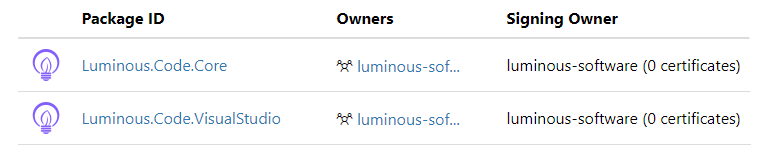
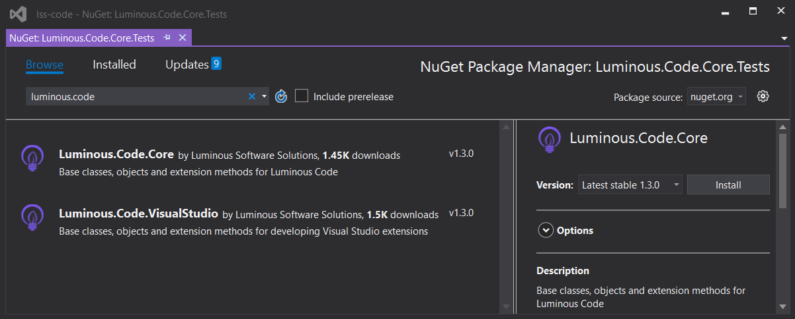
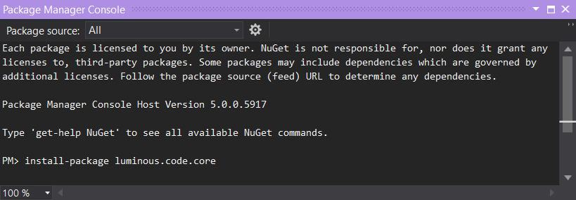

## Download From Nuget.org

There are two Nuget packagesto download:

- [Luminous.Code.Core][luminous-code-core-url]
- [Luminous.Code.VisualStudio][luminous-code-visualstudio-url]

[luminous-code-core-url]: https://www.nuget.org/packages/Luminous.Code.Core
[luminous-code-visualstudio-url]: https://www.nuget.org/packages/Luminous.Code.VisualStudio

## Install Via Nuget Package  Manager

1. Right-click on the project where you want to install the package(s)
2. Select _Manage Nuget Packages_
2. Type `luminous.code` in the search box
3. Click on the package(s) you want to install
4. Click the _Install_ button

## Install Via Package Manager Console

1. Click on the project where you want to install the package(s)
2. Click View | Other Windows | Package Manager Console
3. Make sure the correct project is selected as _Default Project_
4. Type `install-package luminous.code.core` or `install-package luminous.code.visualstudio`
5. Press `ENTER`

